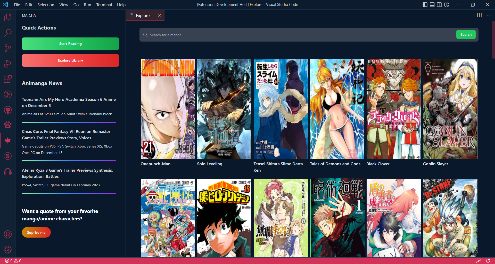

<h2 align="center" style="border-bottom: none">
    

    

    Matcha
</h2>

Read your favorite mangas through VSCode

 

 

### Quick Notice

Due to API (proxy api) issues, this extension will not be able to display mangas anymore, for now :(

### Usage

This extension features a number of features:

- Read manga directly while coding
- Get manga and anime news
- Save your mangas to your list

### Preview

### Credits

Matcha wouldn't even be made without these fellas (really eased me as development would be much more complicated).

> https://consumet.org/ -> One of the most reliable manga scraping API available, proxying would be hard without this API :)
